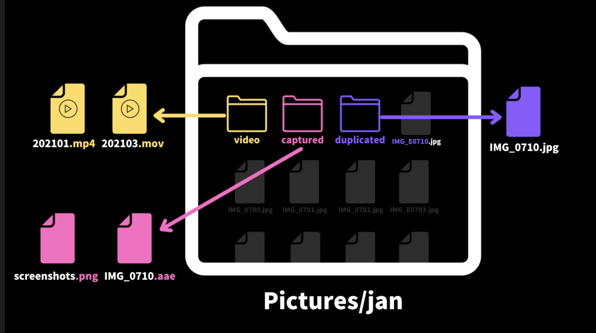

# photo-organizer

This project started to organize image files better *- I take a lot of screenshot and my desktop gets messy easily🤦🏻‍♀️*

There are 3 ways so far
***
## 1. Ellie's way  

Ellie organizes all her photos every month before uploading to google photo  
Her way is simple  
- All the screenshots with .png or .aae extension -> screenshot folder  
- All video file with .mp4 or .mov -> video folder  
- When you edit an original photo titled "IMG_1234", it will make a new file titled "IMG_E1234". Then We want to keep edited one and put original one to duplicated folder.  

<br>As follows 👀

<br><br>
***
## 2. Screenshots only!  

When you simply takes screenshots, it will save files as below   
> "Screen Shot 2021-08-16 at 8.43.41 PM"  
> "Screen Shot 2021-08-17 at 10.54.21 PM"  
> "Screen Shot 2021-08-17 at 10.54.35 PM"  

<br>
Screenshot method will put each file into matching date folder  

> first one -> folder "2021-08-16"  
> others -> folder "2021-08-17"  

<br><br>
***
## 3. Daily folders bases on file created date

If your files have random names and just need to be sorted by created date, this one might be helpful!  
> "a.png" - created at 2021-08-20 -> folder "2021-08-20"  
> "b.mp4" - created at 2021-08-19 -> folder "2021-08-19"  

<br><br>
***
## Installation
1. Clone the repo
```
git clone https://github.com/redpandaathome/photo-organizer.git
```

2. Install NPM packages
```
npm install
```
<br><br>
***
## How to run?
1. Ellie's method 🏃🏻‍♀️
```
// ex - node app.js ellie sourcePath _
node app.js ellie /Users/forky/Downloads/photo/test/ _
```
2. Screenshot method 🏃🏻‍♀️🏃🏻‍♀️
```
// ex - node app.js screenshot sourcePath targetPath
node app.js screenshot /Users/forky/Desktop/ /Users/forky/Desktop/Screenshot/
```
3. Daily method 🏃🏻‍♀️🏃🏻‍♀️🏃🏻‍♀️
```
// ex - node app.js daily sourcePath targetPath
node app.js daily /Users/forky/Desktop/ /Users/forky/Desktop/DailyScreenshot/
```
<br><br>
***
## Little Note ✉️
If there's issue or request, please feel free to let me know 🙌🏻  

This is my very first project to be shared and it would be great if this project could be helpful to someone.  

Cheers!🍻
